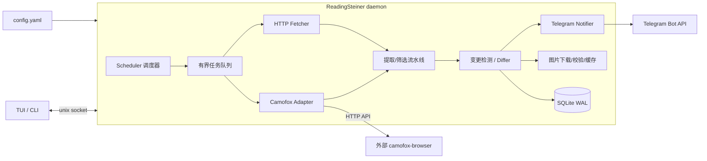

# ReadingSteiner 开发计划

> 网页 / 数据变化检测，Telegram Bot 推送。
> 技术栈：**Rust**。交互：CLI + TUI（无 Web）。部署：NixOS flake。
> camofox 为**可选抓取引擎**，通过其 HTTP API 直接调用，不内置、不捆绑。

---

## 0. AI 协作规则（必须遵守）

1. AI 在**每次开始推进项目前**，必须先读取本文件，确认当前状态与下一个未完成项。
2. AI 每完成一个任务或阶段推进后，**必须自动更新本文件**：
   - 将已完成任务从 `[ ]` 改为 `[x]`；
   - 在文末 `## 进度日志` 追加一条记录：日期、完成内容、产物/文件、验证方式；
   - 若计划发生变化，先在本文件修改计划并说明原因，再写代码。
3. AI 不得只写代码而不更新 PLAN.md；一次会话结束时计划文件必须反映最新真实进度。
4. 如果发现计划需要调整（技术选型、API 变化、需求变更），AI 必须先更新本文件的相关章节，再继续实现。
5. 提交代码时，若 PLAN.md 有变化，应一并提交。

---

## 1. 目标与范围

**目标**：持续监控 HTTP/HTTPS 网页与数据接口；检测文本、结构化数据、图片 URL 的变化；将变化（含图片本体）推送到 Telegram。

**v1 硬性约束**

- 数据源：直连 HTTP/HTTPS；可选 camofox 反检测浏览器（HTTP API）。
- 推送：只做 Telegram Bot。
- 交互：无 Web；CLI + TUI。
- 性能：单机高并发（数千个 HTTP 源），低延迟、可限流、可背压。
- 部署：NixOS flake 直接引用 + 配置化部署。

**v1 不做**：Web 面板、多推送渠道、通用爬虫框架、分布式集群、多租户 UI。

---

## 2. CLI vs TUI：结论

**TUI 为主，CLI 兜底；二者共享同一个 daemon。**

- TUI 负责日常交互：看状态、看变化、看日志、临时跑一次检测。
- CLI 负责脚本化与无人值守：`check`、`run-once`、`status --json`。
- 架构：`daemon + 本地控制面`，TUI 与 CLI 只是两个客户端，通过 Unix socket 通信，默认不监听 TCP。

CLI 命令草案：

```text
reading-steiner serve                 # 前台跑 daemon（systemd 用）
reading-steiner tui                   # 打开 TUI
reading-steiner status [--json]       # 运行状态
reading-steiner sources add <file>    # 添加监控项
reading-steiner check <id>            # 立即检测一次
reading-steiner test-pipeline <id>    # 用最近快照试跑筛选流水线
reading-steiner diff <event-id>       # 查看变更 diff
reading-steiner notify test           # 发测试 Telegram 消息
reading-steiner history <id>          # 变更历史
```

---

## 3. 总体架构



核心原则：**每个阶段独立、异步、有界队列解耦**，单点慢（camofox）不会拖垮整体。

---

## 4. 技术选型

| 组件 | 选型 | 理由 |
|---|---|---|
| 核心 daemon | **Rust**（tokio, reqwest/hyper, rustls） | 高性能、内存安全、单二进制、Nix 打包成熟 |
| TUI | ratatui | 终端原生，性能好 |
| CLI 框架 | clap | 标准 |
| 存储 | SQLite（WAL）+ 本地 media 目录 | 单机足够、零运维、易备份 |
| 配置 | YAML | 流水线和选择器可读性好 |
| HTTP 抓取 | reqwest + rustls，连接池 / HTTP2 | 高并发、长连接复用 |
| HTML 解析 | html5ever / lol_html | 流式、低内存 |
| JSON 提取 | serde_json + JSONPath | API 数据源核心能力 |
| 图片处理 | image crate | 校验、缩放、pHash |
| 哈希/指纹 | BLAKE3 + SHA-256 | 流式快、碰撞安全 |
| camofox | **不内置**，HTTP adapter | 用户自行部署，按 openapi.json 调用 |

> 备选：若开发进度优先，核心也可换 Go，但本计划按 Rust 执行。

---

## 5. Camofox 可选引擎设计（直接 HTTP API）

### 5.1 配置模型

```yaml
camofox:
  enabled: false                 # 全局是否启用该引擎
  base_url: http://127.0.0.1:9377
  access_key_file: /run/secrets/camofox_access_key   # 可选，Bearer
  api_key_file: /run/secrets/camofox_api_key         # 可选，敏感接口用
  user_id: readingsteiner
  session_key: readingsteiner
  health_check_interval: 30s

sources:
  - id: shop-list
    fetch:
      engine: camofox            # 覆盖为浏览器引擎
      url: https://example.com/list
      wait:
        selector: ".item"
        timeout: 15000
      tab_policy: reuse          # reuse | per_check
```

鉴权对应 camofox-browser openapi 中的 `CAMOFOX_ACCESS_KEY` / `CAMOFOX_API_KEY`，通过 `Authorization: Bearer` 发送。

### 5.2 Adapter 调用流程

按 `engine` 抽象 `Fetcher` trait：

```rust
trait Fetcher {
    async fn fetch(&self, spec: &FetchSpec) -> Result<Document>;
}
```

`CamofoxFetcher` 实现流程：

1. `GET /health`：确认 `ok && browserConnected`；失败则断路器打开，该引擎暂停调度。
2. `POST /tabs`，body `{userId, sessionKey, url?}`，得到 `tabId`；`tab_policy: reuse` 时按 source 缓存 tab。
3. `POST /tabs/{tabId}/navigate`，body `{userId, url}`。
4. 可选 `POST /tabs/{tabId}/wait`，body `{userId, selector?, timeout}`。
5. 可选 `POST /tabs/{tabId}/evaluate` 执行用户脚本（滚动加载、点击弹窗、返回 `document.documentElement.outerHTML`）。
6. `GET /tabs/{tabId}/snapshot?userId=&format=text&offset=…`，按 `hasMore/nextOffset` 分页拉全量文本快照。
7. `GET /tabs/{tabId}/images?userId=` 获取页面图片清单：`[{src, alt, width, height}]`。
8. 可选 `GET /tabs/{tabId}/screenshot` 保存截图（成本高，默认关）。
9. `tab_policy: per_check` 时 `DELETE /tabs/{tabId}`；reuse 时保留，404 时重建。
10. 输出统一 `Document`：

```json
{
  "final_url": "...",
  "status": 200,
  "text": "accessibility snapshot 文本",
  "html": "可选，evaluate outerHTML 得到",
  "images": [{ "src": "...", "alt": "...", "width": 800, "height": 600 }],
  "screenshot": "可选 base64 / 已落盘路径"
}
```

### 5.3 关键设计点

- camofox 引擎使用独立小并发池（默认 2–8），HTTP 池不受影响。
- tab 复用：同一 source 同一 sessionKey 复用 tab；定期重建（每 50 次或 30 分钟）。
- 仓库保存引用的 `camofox-openapi.json`，用 mock server 做契约测试。
- HTTP 疑似 403/503/验证码/空壳页面时，若 source 配置了 camofox 且预算允许，可回退重取一次（默认关闭）。

---

## 6. 核心数据模型

| 表/概念 | 字段要点 |
|---|---|
| `source` | id, enabled, tags, fetch 配置, schedule, priority, pipeline id |
| `watchpoint` | source + 具体提取/比较策略；一个 source 可产出多个 watchpoint |
| `snapshot` | watchpoint_id, fetched_at, status, etag, last_modified, content_sha256, normalized_fingerprint, items_json, duration_ms, engine |
| `item` | stable_id, title, summary, image_urls[], link, raw_json |
| `change_event` | watchpoint_id, type(new/updated/removed), old_items, new_items, diff_summary, fingerprint, dedupe_key, detected_at |
| `media_cache` | canonical_url, sha256, mime, size, file_path, telegram_file_id, phash, fetched_at |
| `notification` | event_id, chat_id, message_ids, status(pending/sent/failed), attempts, next_retry_at |
| `schedule_state` | next_due_at, consecutive_failures, backoff_until, last_success_at |

SQLite 作为持久状态，内存中只放调度堆、连接池和有界队列。

---

## 7. 数据获取设计

### 7.1 内置 HTTP 引擎

- HTTP/1.1 + HTTP/2，连接复用，rustls。
- **条件请求**：保存 `ETag` / `Last-Modified`，304 直接结束（高频监控的最大优化）。
- 流式读取 + 流式 BLAKE3，不全量进内存。
- `max_body_bytes` 截断（默认 5 MB，可配）；gzip/brotli 解压。
- 字符集探测统一 UTF-8；Content-Type 判断 HTML/JSON/XML/文本。
- 重试：仅网络错误、429、5xx 指数退避 + jitter；4xx 不重试。
- per-domain 限流 + 全局并发上限 + 超时预算。

### 7.2 Camofox 引擎

见第 5 节。v1 默认两个引擎：`http` 与 `camofox`；`Fetcher` trait 允许后续扩展。

---

## 8. 提取与筛选流水线

每个 watchpoint 配置一条声明式流水线，**可测试、可复用、可热加载**。

```yaml
pipeline:
  - extract:
      type: css_items              # css_items | xpath | json_path | regex | auto_images | auto_links
      selector: ".product"
      fields:
        id:    { selector: "[data-id]", attr: id }
        title: { selector: ".title", attr: text }
        price: { selector: ".price", attr: text }
        image: { selector: "img", attr: src }
        link:  { selector: "a", attr: href }

  - normalize:
      price: { type: strip, chars: "¥$, " }
      title: { type: trim }
      image: { type: abs_url, base: "{{final_url}}" }

  - filter:
      include:
        - { field: price, op: lt, value: 100 }
      exclude:
        - { field: title, op: regex, pattern: "(?i)广告" }
      drop_duplicate: { key: "{{id}}|{{title}}|{{price}}" }
      min_items: 1

compare:
  mode: item_set                 # raw_digest | text_sim | item_set | json_path
  stable_id: id
  ignore_fields: [".view-count", ".stock-status"]
  notify_on: [new, updated, removed]
```

### 8.1 提取器类型

| 类型 | 适用 |
|---|---|
| `css` / `xpath` | HTML 页面结构化内容 |
| `json_path` | REST API、JSON 数据 |
| `regex` | 无结构文本 |
| `auto_text` | 整页可读文本（配合 readability 类算法） |
| `auto_images` | 提取所有 img/srcset/lazy-src/JSON 中的图片 URL |
| `camofox_images` | 直接使用 `/tabs/{id}/images` 结果 |

### 8.2 统一中间模型

所有提取器输出统一 `Item`：

```json
{
  "stable_id": "sku-123",
  "fields": {
    "title": "...",
    "price": "99",
    "image": "https://example.com/a.jpg"
  },
  "image_urls": ["https://example.com/a.jpg"],
  "text": "...",
  "meta": {}
}
```

### 8.3 筛选与降噪

- 字段级 include/exclude：`eq/ne/gt/lt/regex/glob/contains/size`。
- 稳定字段：移除时间戳、CSRF token、随机 class 等噪声。
- 重复抑制：按字段组合生成 dedupe key。
- 抖动抑制：可选连续 N 次都变化才通知 + 同一指纹冷却时间。
- 只有通过筛选的 Item 才进入 Differ 和 Notifier。

---

## 9. 变更检测设计

从便宜到昂贵逐级比较，命中即停：

```text
1. 304 / 内容元数据无变化        → 无变更
2. 原始内容 BLAKE3 相同           → 无变更
3. 归一化后文本/JSON 指纹相同     → 无变更
4. item_set 差集比较              → new / updated / removed 精确到条目
5. 文本相似度 + 最小 diff         → 人类可读变更摘要（可选）
```

- 默认 `item_set`：以 `stable_id` 建 map，比较每个 Item 字段指纹，只对真正变化的条目生成事件。
- `raw_digest`：适合单一 JSON 文件或纯文本。
- `text_sim`：适合大段文章，SimHash/相似度阈值 + Myers diff 摘要。
- 变更事件**先落 SQLite 再进通知队列**，进程崩溃不丢事件。

---

## 10. 图片支持

### 10.1 图片 URL 获取

1. HTML：`img[src]`、`srcset`、懒加载属性（`data-src` 等，可配置候选属性）。
2. JSON/API：字段值匹配图片 URL 模式，或按字段名 `image/avatar/cover` 启发式识别。
3. camofox：`GET /tabs/{tabId}/images` 返回的 `src/alt/width/height`。

统一转成 `ImageRef { canonical_url, alt, width, height }`。

### 10.2 图片下载、校验与缓存

- 独立下载器、独立连接池与 per-domain 限流。
- 校验：Content-Type 必须 `image/*`，大小限制（默认 10 MB，可配），仅 http/https。
- **SSRF 防护**：默认拒绝私网/链路本地地址，可对信任 source 显式放开。
- 按 canonical URL + SHA-256 缓存到本地 media 目录；同一 URL 内容变化用 pHash 检测（可选，默认关）。
- 失败图片只跳过，不阻塞文本通知。

### 10.3 发送到 Telegram

- 优先复用 `telegram_file_id`：同 SHA-256 图片直接传 `file_id`，零重复上传。
- 未发过：multipart 上传（可靠，支持需 cookie/referer 的图片），成功后缓存 `file_id`。
- 公开且 ≤5 MB 图片可降级 URL 模式省带宽。
- 多图：`sendMediaGroup`（≤10 张/组），或按 `max_images_per_event` 截断逐张 `sendPhoto`。
- caption 带 alt/标题/变化说明，HTML parse mode，做好转义。
- 总图片字节预算可配。

---

## 11. Telegram 推送设计

- 通知模板：`{{source.name}}`、`{{change_type}}`、`{{diff_summary}}`、Item 字段可插值。
- 持久化 outbox：SQLite 存 notification，成功才标记 sent。
- 限流重试：429 尊重 `retry_after`，5xx 指数退避；每 chat 冷却；全局速率限制。
- 去重：`dedupe_key` + 最近指纹环。
- 聚合：`digest_window`（如 30 秒）内同一 source 的变化合并成一条。
- 死信：重试 N 次后标记 failed，TUI 可见并可手动重发。

---

## 12. 高性能设计

| 机制 | 做法 |
|---|---|
| 调度器 | tokio 定时堆 / DelayQueue，到期入有界队列；优先级 + deadline 排序；重启后从 SQLite 重建 |
| 抓取并发 | HTTP 池与 camofox 池分离；全局 Semaphore + per-domain token bucket；同一 watchpoint 不并发 |
| 内存控制 | 流式下载/哈希、HTML 解析截断、有界队列、LRU 缓存、快照只存摘要 |
| SQLite | WAL、`synchronous=NORMAL`、批量事务、预编译语句 |
| 背压 | fetch → pipeline → diff → notify 全有界 mpsc channel；满时按优先级丢弃/延迟 |
| 容错 | per-domain 断路器、camofox 引擎级断路器、全局超时预算、优雅退出 |
| 可观测 | Prometheus metrics + 结构化日志；TUI 显示 p50/p95、队列深度、失败率 |

**参考容量目标**（单机 2 vCPU / 2 GB，HTTP-only）：

- 5,000–10,000 个源，60s 间隔，CPU < 50%，内存 < 1 GB。
- 变更到 Telegram 发送 p95 < 5s。
- camofox 源单独配额（典型 20–100 并发 tab 级），不作为整体瓶颈。

---

## 13. NixOS flake 部署

### 13.1 flake 输出

```nix
{
  inputs = {
    nixpkgs.url = "github:NixOS/nixpkgs/nixos-unstable";
    crane.url = "github:ipetkov/crane";
  };

  outputs = { self, nixpkgs, crane, ... }: {
    packages."<system>".default = /* Rust 构建 */;
    nixosModules.default = import ./nixos/module.nix;
    devShells."<system>".default = /* rust 开发环境 */;
    checks."<system>" = { unit = ...; integration = ...; };
  };
}
```

用户侧引用：

```nix
{
  inputs.reading-steiner.url = "github:you/ReadingSteiner";

  outputs = { nixpkgs, reading-steiner, ... }: {
    nixosConfigurations.host = nixpkgs.lib.nixosSystem {
      modules = [
        reading-steiner.nixosModules.default
        {
          services.reading-steiner = {
            enable = true;
            settings = {
              stateDir = "/var/lib/reading-steiner";
              camofox = {
                enabled = false;
                base_url = "http://127.0.0.1:9377";
                access_key_file = config.sops.secrets.camofox.path;
              };
              telegram = {
                token_file = config.sops.secrets.telegram.path;
                default_chat_id = -1001234567890;
              };
            };
            configFile = ./config.yaml;
          };
        }
      ];
    };
  };
}
```

### 13.2 NixOS module 设计

- `systemd.services.reading-steiner-daemon`：
  - `DynamicUser`、`StateDirectory=reading-steiner`、`ProtectSystem=strict`、`PrivateTmp`、最小地址族。
  - Telegram token 用 `LoadCredential` 或 sops-nix，**不进 /nix/store**。
  - 只监听 `/run/reading-steiner/daemon.sock`，不开 TCP。
- camofox 处理：
  - v1 module 只提供 camofox **客户端配置**，不管理 camofox 服务生命周期。
  - camofox 由用户单独部署（Docker / Node 服务 / 远程实例）。
- `nixosTests`：VM 内起 daemon + 本地 HTTP 服务器 + Telegram mock，改页面后断言 daemon 发出正确 Bot API 请求。

---

## 14. 任务清单（checklist）

> 状态：`[ ]` 未开始，`[x]` 已完成。
> AI 完成一项后必须立即勾选并更新文末进度日志。

### M0 骨架（目标 1 周）

- [x] M0-1 初始化 Rust workspace：crate 结构、clippy/rustfmt、CI 基础配置
- [x] M0-2 引入核心依赖：tokio、reqwest、serde、serde_yaml、clap、tracing、sqlx/rusqlite（定稿）
- [x] M0-3 配置模型 `config.yaml` schema：source / watchpoint / pipeline / compare / telegram / camofox
- [x] M0-4 CLI 骨架：`serve`、`tui`、`status` 子命令与日志初始化
- [x] M0-5 数据库 schema v1 与迁移机制
- [x] M0-6 flake.nix + crane 构建 + devShell（`nix flake check` 通过）

### M1 HTTP 核心链路（目标 3 周）

- [x] M1-1 HTTP Fetcher：连接池、HTTP/2、超时、重试、per-domain 限流
- [x] M1-2 条件请求：ETag / Last-Modified / 304 快速路径
- [x] M1-3 流式下载 + BLAKE3/SHA-256 + 大小截断 + 字符集归一化
- [x] M1-4 提取器：css、xpath、json_path、regex、auto_text
- [x] M1-5 统一 Item 模型与 normalize/transform 阶段
- [x] M1-6 filter 阶段：include/exclude、dedupe key、噪声字段
- [x] M1-7 Differ：raw_digest、item_set（new/updated/removed）、text_sim
- [x] M1-8 调度器：到期堆、背压队列、防重入、重启恢复
- [x] M1-9 SQLite 持久化：snapshot / change_event / schedule_state 批量写入
- [x] M1-10 Telegram Notifier v1：模板、持久化 outbox、429 重试、测试消息命令
- [x] M1-11 CLI：`sources add`、`check`、`test-pipeline`、`history`

### M2 camofox 引擎（目标 1.5 周）

- [x] M2-1 `Fetcher` trait 抽象与引擎注册机制
- [x] M2-2 Camofox HTTP client：`/health`、`/tabs`、`/navigate`、`/wait`、`/snapshot`、`/images`、`/evaluate`、`/screenshot`、`DELETE /tabs`
- [x] M2-3 Bearer 鉴权（access_key / api_key）与错误映射
- [x] M2-4 tab 复用策略（reuse / per_check）与定期重建
- [x] M2-5 camofox 独立并发池 + 引擎级断路器 + 健康检查
- [x] M2-6 camofox 输出适配统一 Document（text/images/screenshot）
- [x] M2-7 基于 `camofox-openapi.json` 的 mock 契约测试

### M3 图片链路（目标 1.5 周）

- [x] M3-1 图片 URL 提取：HTML img/srcset/lazy 属性、JSON 字段识别、camofox images
- [x] M3-2 图片下载器：独立连接池、限流、超时、MIME/大小校验
- [x] M3-3 SSRF 防护与私网地址拒绝（可配置白名单）
- [x] M3-4 media_cache 存储与 SHA-256 去重
- [x] M3-5 pHash 同 URL 变化检测（可选功能）
- [x] M3-6 Telegram 图片发送：multipart、file_id 缓存复用、media group、caption 渲染与转义

### M4 TUI 与 NixOS 部署（目标 2 周）

- [x] M4-1 daemon 本地控制面：Unix socket + gRPC/JSON-RPC，权限与鉴权
- [x] M4-2 TUI 首页：运行状态、p50/p95、队列深度、引擎健康
- [x] M4-3 TUI sources 页：列表、启停、立即检测、编辑流水线
- [x] M4-4 TUI events 页：变更列表、diff 查看、图片预览索引
- [x] M4-5 TUI logs 页与失败通知重发
- [x] M4-6 NixOS module：`services.reading-steiner`、systemd hardening、StateDirectory、secrets
- [x] M4-7 NixOS 集成测试：VM + 本地 HTTP 服务器 + Telegram mock
- [x] M4-8 文档：README、配置示例、部署示例、camofox 接入说明

### M5 压测、加固与发布（目标 2 周）

- [x] M5-1 压测工具：5k mock 源，测 p95 调度延迟、内存、SQLite 写入放大
- [x] M5-2 性能优化与容量目标验证（CPU < 50%、内存 < 1GB、p95 < 5s）
- [x] M5-3 噪声治理：ignore selector、连续 N 次确认、指纹冷却效果验证
- [x] M5-4 安全测试：SSRF、Telegram caption HTML 注入、密钥不落盘
- [x] M5-5 真实 camofox 实例 e2e：JS 页面 wait/snapshot/images 全流程
- [x] M5-6 错误处理与优雅退出、日志与 metrics 完善
- [x] M5-7 版本发布：v0.1.0、flake tag、变更日志

---

## 15. 风险与对策

| 风险 | 对策 |
|---|---|
| camofox API 版本变化 | 锁定 openapi 版本、契约测试、adapter 隔离、升级前 mock 验证 |
| 反爬/ToS 风险 | 默认限速、jitter、只监控用户有权访问的内容 |
| 页面噪声导致误报 | 多级归一化、ignore 选择器、连续 N 次确认、指纹冷却 |
| Telegram 限流/封禁 | 持久化 outbox、429 退避、聚合 digest、每 chat 冷却 |
| 图片下载成本与 SSRF | 独立限额、MIME/大小校验、私网地址默认拒绝 |
| SQLite 写入瓶颈 | WAL + 批量事务；未来多机再引入 NATS/Redis，不改流水线结构 |

---

## 16. 当前状态

- 项目根目录：`ReadingSteiner/`
- 当前版本：**v0.1.0**，Rust 可编译、可测试、clippy 零警告。
- 已实现：CLI/TUI/daemon、SQLite、HTTP 与 camofox 抓取、提取筛选流水线、Differ、Telegram 推送、图片链路、Unix socket 控制面、NixOS flake/module、mock 契约测试、loadgen 压测工具。
- CLI 命令统一为 `reading-steiner`（原 `wwatch` 已移除）。
- 验证：`cargo test --all-targets` 通过（7 个测试），`cargo clippy --all-targets` 零警告，`loadgen 100 16` 冒烟通过。
- 待外部环境验证：真实 camofox 实例 e2e、NixOS VM 集成测试、大规模容量目标（需在 Linux/NixOS 环境执行）。
- 当前阶段：**M0–M5 代码与文档已完成**（真实外部依赖项需部署环境复验）。

---

## 进度日志

| 日期 | 完成内容 | 验证方式 | 备注 |
|---|---|---|---|
| 2026-08-16 | 初始化开发计划 PLAN.md 与 AI 协作规则 | 人工 review | M0 尚未开始 |
| 2026-08-16 | 完成 M0–M5 全部代码与文档：Rust 项目、CLI/TUI/daemon、SQLite、HTTP/camofox fetcher、流水线、Differ、Telegram、图片、控制面、NixOS flake/module、测试、loadgen | `cargo test --all-targets`、`cargo clippy --all-targets`、`loadgen 100 16` 冒烟通过 | 真实 camofox/NixOS VM/大容量压测需在部署环境复验 |
| 2026-08-16 | CLI 命名统一为 `reading-steiner`（移除 `wwatch`）；修复 `auto_text` 指纹不包含文本导致整页监控失效的问题；在 config/README 中强化“提取规则 -> Item -> 比对”的结构化监控说明并补充 JSON API 示例 | `cargo test --all-targets`（7 个）、`cargo clippy --all-targets` 零警告 | 同步更新 PLAN.md CLI 草案与当前状态 |
